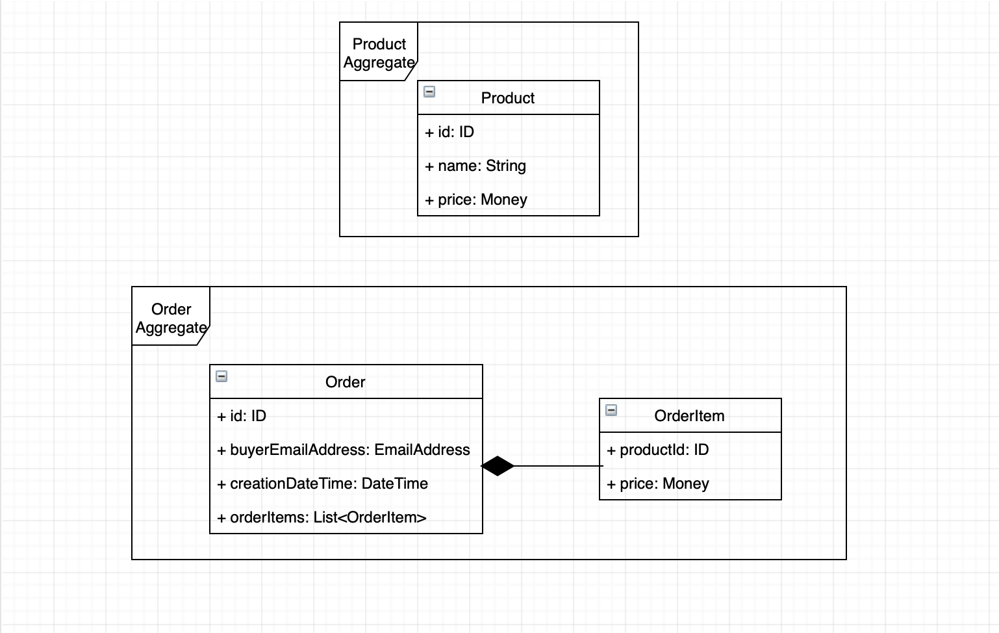

## Domain analysis

In order to better understand the functional requirements, I will first apply the BDD approach to defining some examples based on the requirements described in the section above. Here are some such examples using Gherkin format:

> Given Bob is an admin user  
> When Bob attempts to create a product with name “Samsung S10” and the price of $1000.00  
> Then the product is successfully created

> Given Bob is an admin user  
> When Bob attempts to retrieve the products available in the Product Catalog  
> Then a list of all the products is returned

> Given Bob is an admin user  
> And a product exists with name “Samsung S10” and the price $1000.00  
> When Bob attempts to change the price of the product to $800.00  
> Then the price of the product is updated to $800.00

> Given John is a user  
> And a product exists with name “Samsung S10” and the price $1000.00  
> When John attempts to place an order for the product and provides an email address of “bob@bobscomp.com”  
> Then an order is created with the provided details

> Given John is a user  
> When John attempts to place an order but no product is selected  
> Then no order is created  
> And an error message is presented to the user informing them that a product should be selected

> Given John is a user  
> And a product exists with name “Samsung S10” and the price $1000.00  
> When John attempts to place an order for the product and doesn't provide any email address  
> Then no order is created  
> And an error message is presented to the user informing them that an email address should be provided

In a real world application, it would be very important to implement authentication and authorisation. The above examples state the possible roles users may have in the system, but the implementation will ignore that information as no authentication/authorisation will be added for now.

Based on all the above, I could identify 2 Aggregates: Product and Order, each one being used for implementing different scenarios. Here is a diagram depicting how the domain model could look like:

