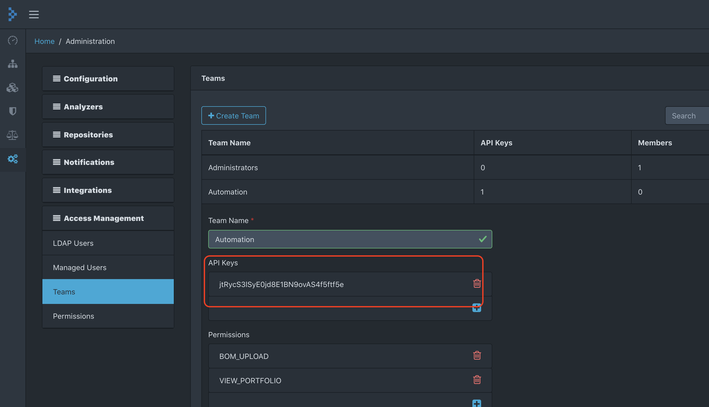

## Checking dependencies for vulnerabilities

It is a best practice in security to constantly check the application's dependencies for vulnerabilities. Run the following command to have a report generated by OWASP Dependency-Check tool:
```bash
$ ./gradlew dependencyCheckAnalyze
```
The report could be found at `/build/reports/dependency-check-report.html`. Here you could check what are some possible vulnerabilities found in the dependencies of the application.

### OWASP Dependency-Tracker

A better approach, which could later also be integrate in the CI/CD pipeline is to utilize OWASP Dependency Tracker. For convenience, by running `docker-compose`, it will also be started. If you want to play with it without having to spin up all the other services run it with Docker:
```bash
$ docker run -d -m 8192m -p 8080:8080 owasp/dependency-track
```
Dependency-Tracker will be available at http://localhost:8080/.

Generate a [BOM](https://en.wikipedia.org/wiki/Software_bill_of_materials) file including all the application's dependencies using [CyclonedX](https://cyclonedx.org/) format:
```bash
$ ./gradlew cyclonedxBom
```

This command will generate a report available at `/build/reports/bom.xml`.
Next go to http://localhost:8080/projects and create a new project. Pick the UUID of the project from the URL and copy it somewhere. The URL will look similar to this http://localhost:8080/projects/b91ee636-09d7-4511-9a75-192cba03e1ae.
After that you will have get an API key by navigating to `Administration > Access Management > Teams` and choose `Automation` team which comes with an API key already generated (feel free to generate a new one if you wish):



The final step is to push the report generated above to Dependency-Tracker:

```shell script
curl --request POST 'http://localhost:8080/api/v1/bom' \
--header 'X-Api-Key: jtRycS3lSyE0jd8E1BN9ovAS4f5ftf5e' \
--form 'project=b91ee636-09d7-4511-9a75-192cba03e1ae' \
--form 'bom=@./build/reports/bom.xml'
```

Now you will be able to check for vulnerabilities or outdated dependencies.